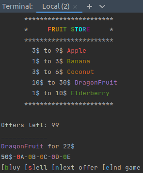

# Fruit Store



Fruit store is a console game written in Rust. In Fruit Store the player is an aspiring fruit dealer that starts with 50$ and is presented with offers to buy fruit from the Fruit Store. In total 100 random offers are presented, only one offer is available at a time but the player can purchase multiple samples.  When there are no offers left from the fruit store, the game is over.

Fruit store was the first Rust application which I wrote based on knowledge learnt from ['the Rust programming'](https://doc.rust-lang.org/book/) it uses multi threading to time out fruit offers and capture keyboard input from the console, one key at a time using raw mode.

## Usage

Application uses termion for reading & writing to the terminal. Termion supports Redox, Mac OS X, and Linux (or, in general, ANSI terminals).
 
```bash
$ cargo run
```

## Keyboard keys

Keys used when in game are:

b= buy offer
s= sell offer
n= next offer
e= end game (jumps to game over, showing player score)

## License

[MIT](https://choosealicense.com/licenses/mit/)
